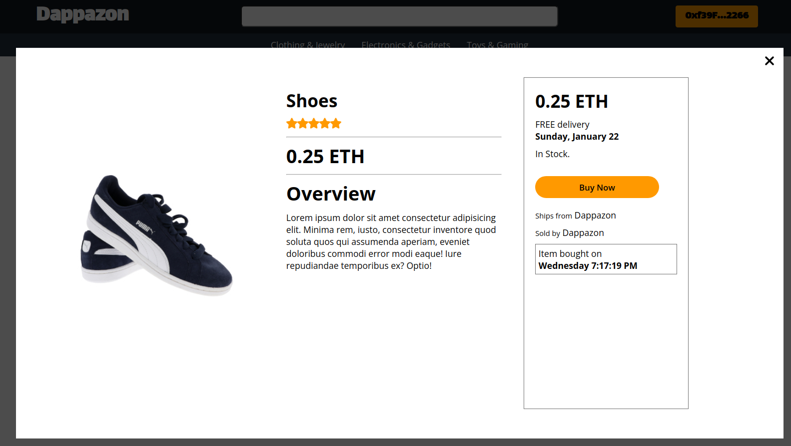

# Simple Amazon Web3

## Introduction

A simple marketplace (like amazon) using web3!

## Technology Stack & Tools

- Visual Studio Code
- nvm / nodejs / npm / npx
- Javascript (React & Testing)
- Solidity (Writing Smart Contracts & Tests)
- [Hardhat](https://hardhat.org/) (Development Framework)
- [Ethers.js](https://docs.ethers.io/v5/) (Blockchain Interaction)
- [React.js](https://reactjs.org/) (Frontend Framework)
- [Metamask](https://metamask.io/)
- [Chai](https://chaijs.com) (testing)
- IPFS
- QuickNode

## Requirements For Initial Setup

- Install [NodeJS](https://nodejs.org/en/)
- Run hardhat node: npx hardhat node
- Deploy smart contract in local node: npx hardhat run ./scripts/deploy.js --network localhost`
- Update src/config.json with contract address from previous item
- Connect metamask to localhost:8545 (chain id: 31337)

### To run in external node

- Register an account and Ethereum Test node in [quicknode](https://www.quicknode.com/)
- Set un .env file in root folder with this content:
    * STAGING_QUICKNODE_KEY=(your quicknode url) 
    * PROD_QUICKNODE_KEY=(nothing)
    * PRIVATE_KEY=(your metamask' acoount private key)

## Setting Up
### 1. Clone/Download the Repository
`$ git clone repo_url`

### 2. Install Dependencies
`$ npm install`

### 3. Run tests
`$ npx hardhat test`

### 4. Start Hardhat node
`$ npx hardhat node`

### 5. Run deployment script
In a separate terminal execute:
`$ npx hardhat run ./scripts/deploy.js --network localhost`

### 6. Start frontend
`$ npm run start`